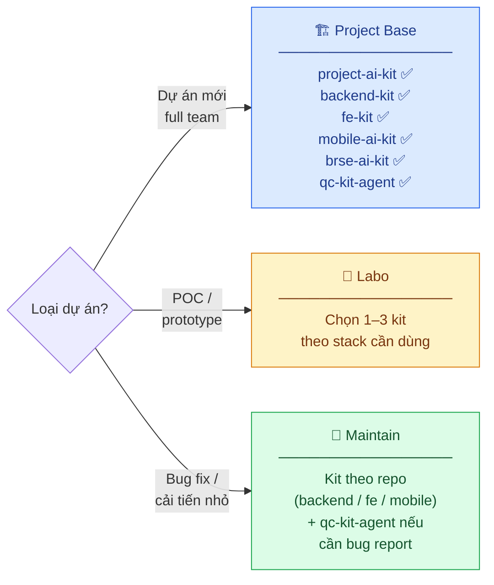

<div align="center">
  

  # Dipro AI Kit

  **Bộ cấu hình Claude Code chuẩn hóa — toàn bộ vòng đời phát triển phần mềm tại Dipro Tech**

  [](LICENSE)
  [](https://claude.ai/code)
</div>

---

## Tổng quan

**Dipro AI Kit** là monorepo chứa **6 kit chuyên biệt** dành cho từng vai trò trong quy trình phát triển phần mềm. Mỗi kit là tập hợp cấu hình **Claude Code** reusable gồm agents, commands, skills, workflows, và rules đã được chuẩn hóa.

```
dipro-ai-kit/
├── project-ai-kit/    → Orchestration toàn dự án (BMAD workflow)
├── backend-kit/       → NestJS + TypeORM + PostgreSQL
├── fe-kit/            → React 19 + Vite 7 + TanStack Query v5
├── mobile-ai-kit/     → Flutter (Riverpod) + React Native
├── brse-ai-kit/       → Basic Design từ Figma (Figma Plugin)
└── qc-kit-agent/      → QC Testing: manual TC + Playwright E2E
```

---

## Yêu cầu

| Yêu cầu | Phiên bản |
|---------|-----------|
| Node.js | ≥ 18 |
| Claude Code CLI | latest |
| Git | any |
| Python 3 | chỉ cần cho `/export-xlsx` |

```bash
npm install -g @anthropic-ai/claude-code
claude --version
```

---

## Các Kit

| Kit | Dành cho | Stack | Hướng dẫn |
|-----|----------|-------|-----------|
| [`project-ai-kit`](project-ai-kit/README.md) | BA · Tech Lead · PM · QC · QA · Designer | Claude Code (multi-agent BMAD) | [README →](project-ai-kit/README.md) |
| [`backend-kit`](backend-kit/README.md) | Backend Developer | NestJS · TypeORM 0.3.x · PostgreSQL · Redis | [README →](backend-kit/README.md) |
| [`fe-kit`](fe-kit/README.md) | Frontend Developer | React 19 · Vite 7 · TanStack Query v5 · Redux Toolkit v2 · Ant Design v6 · TailwindCSS v4 | [README →](fe-kit/README.md) |
| [`mobile-ai-kit`](mobile-ai-kit/README.md) | Mobile Developer | Flutter (Riverpod 3.x · Retrofit+Dio · auto_route) · React Native (RTK Query) | [README →](mobile-ai-kit/README.md) |
| [`brse-ai-kit`](brse-ai-kit/README.md) | BrSE | Figma Plugin + Claude | [README →](brse-ai-kit/README.md) |
| [`qc-kit-agent`](qc-kit-agent/README.md) | QC Engineer | Claude Code · Playwright E2E | [README →](qc-kit-agent/README.md) |

---

## MCP Tools

| Tool | Kit dùng | Chức năng |
|------|---------|-----------|
| `tilth` | project, backend, fe | Code search & analysis |
| Playwright | qc-kit, project-ai-kit | E2E test automation |
| Figma | brse-kit, project-ai-kit | Design reading |
| CodeGraph / Understand-Anything | backend, mobile | Codebase navigation |

---

## Nguyên tắc cốt lõi

1. **Không đoán mò** — Thiếu thông tin → hỏi user, không tự giả định
2. **Đọc trước, hành động sau** — Đọc docs liên quan trước khi generate
3. **Stateless** — Mọi context đọc từ file `.md`, không nhớ session trước
4. **Tool-first** — Dùng `tilth_*` / Grep / Glob thay grep/cat/find thủ công
5. **Blast radius check** — Chạy `tilth_deps` trước khi đổi bất kỳ public interface

> **Phân quyền:** Chỉ **Dev** được phép sửa source code. BA, Tech Lead, PM, QC, QA, Designer **không được chạm** vào source code.

---

## Chọn Kit theo loại dự án



---

## Tài liệu

Docs đầy đủ được viết bằng MkDocs tại `dipro-ai-kit-docs/`:

```bash
cd dipro-ai-kit-docs
pip install -r requirements.txt
mkdocs serve   # http://localhost:8000
```

Video Demo tham khảo: [Demo](https://drive.google.com/file/d/1tNF06n02QX176GS7vqxYTISAEK496mXc/view)
---

<div align="center">
  Built with ❤️ by <strong>DIPRO TECH</strong> — <a href="https://www.dipro-tech.com">dipro-tech.com</a>
</div>


