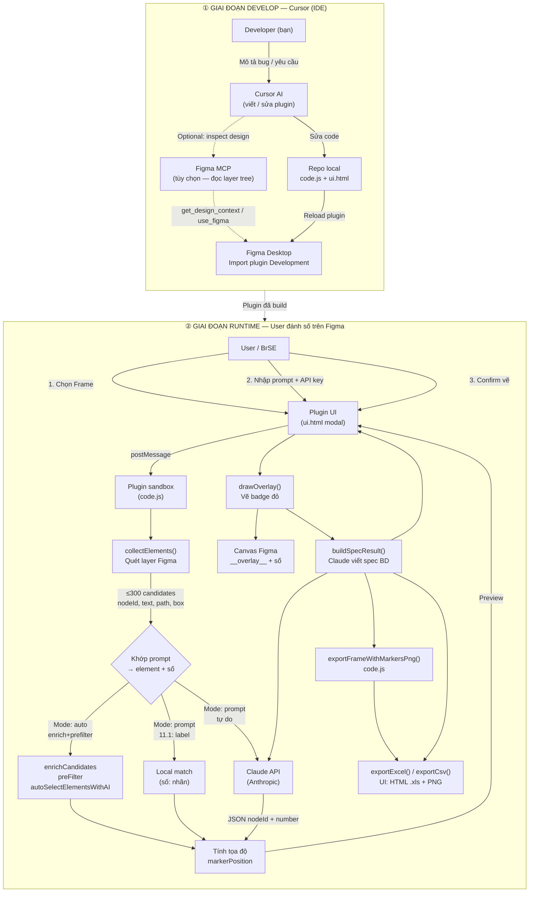
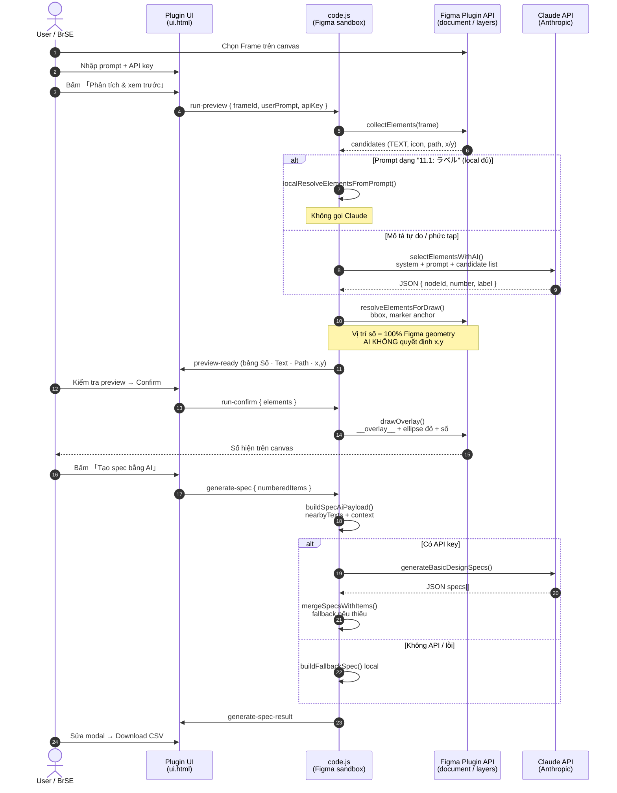
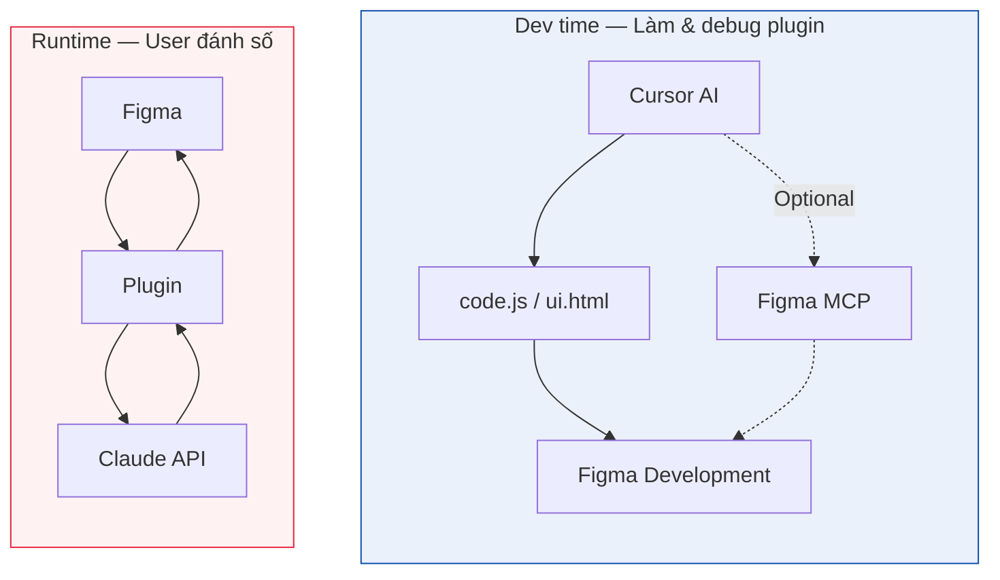
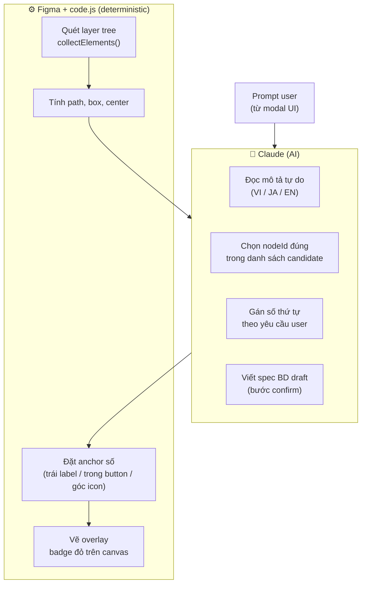

# AI Workflow — Basic Design Numbering (Claude → Cursor → Figma)

Tài liệu này mô tả **workflow tổng thể** cho việc đánh số UI element trong Figma, tách rõ:

- **Dev time**: Cursor (IDE) hỗ trợ viết/sửa/debug plugin
- **Runtime**: User chạy plugin trong Figma để đánh số + (tùy chọn) sinh spec

> Ghi chú: Plugin trong repo **không gọi MCP**. MCP (nếu dùng) chỉ phục vụ **dev/debug trong Cursor**.

---

## 1) Tổng quan: 3 bên làm gì?

---

## 2) Luồng chi tiết khi user bấm chạy (Runtime)

**Mục tiêu phần này**: giải thích rõ **Claude tham gia ở đâu**, **Figma xử lý gì**, và **Cursor không nằm trong runtime**.

---

## 3) Cursor nằm ở đâu trong workflow?

**Kết luận**:

- Cursor xuất hiện ở **dev time** (viết/sửa/debug code).
- Claude xuất hiện ở **runtime** để **phân tích prompt** (và tùy chọn viết spec).
- Figma đảm nhiệm phần **deterministic**: layer tree, bbox, tọa độ, vẽ overlay.

---

## 4) Phân chia trách nhiệm AI vs không-AI

---

## 5) One-liner cho slide

> **Cursor** giúp phát triển & debug plugin (MCP là optional để nhìn Figma từ IDE).  
> **Claude** giúp hiểu prompt user để quyết định *item nào mang số nào* và chọn đúng element.  
> **Figma** đảm bảo tọa độ và vẽ số lên canvas một cách deterministic.

