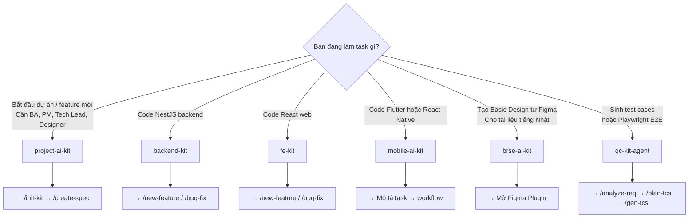

# Chọn Kit phù hợp

---

## Quyết định nhanh



---

## Theo vai trò

| Vai trò | Kit chính | Kit phụ |
|---------|---------|--------|
| **BA** | project-ai-kit | — |
| **Tech Lead** | project-ai-kit | backend-kit, fe-kit |
| **PM** | project-ai-kit | — |
| **Backend Dev** | backend-kit | project-ai-kit (đọc DESIGN) |
| **Frontend Dev** | fe-kit | project-ai-kit (đọc DESIGN) |
| **Mobile Dev** | mobile-ai-kit | project-ai-kit (đọc DESIGN) |
| **QC** | qc-kit-agent | project-ai-kit (đọc SPEC) |
| **QA** | project-ai-kit | backend-kit, fe-kit |
| **BrSE** | brse-ai-kit | project-ai-kit |
| **Designer** | project-ai-kit | — |

---

## Theo giai đoạn dự án

### Giai đoạn 1: Bắt đầu dự án

```
Kit: project-ai-kit
Task: /init-kit
```

### Giai đoạn 2: Phân tích requirement (Phase 1-2)

```
BA   → project-ai-kit → /create-spec
QC   → qc-kit-agent   → /analyze-req → /plan-tcs → /gen-tcs
TL   → project-ai-kit → /create-design
Des  → project-ai-kit → /create-ui-design
```

### Giai đoạn 3: Planning (Phase 3)

```
TL  → project-ai-kit → /create-tasks
PM  → project-ai-kit → /create-plan
```

### Giai đoạn 4: Development (Phase 5)

```
BE dev  → backend-kit  → /new-feature (theo task file)
FE dev  → fe-kit       → /new-feature (theo task file)
Mob dev → mobile-ai-kit → workflows/new-feature.md
```

### Giai đoạn 5: Testing (Phase 7)

```
QC manual  → qc-kit-agent  → /test/generate_test_execution_checklist
QC auto    → qc-kit-agent  → /gen-automation
```

---

## Câu hỏi thường gặp

### "Tôi là dev, có cần dùng project-ai-kit không?"

**Có** — để đọc DESIGN.md, task file, và API Contract từ DOCS_ROOT. Nhưng để code, dùng kit chuyên biệt (backend/fe/mobile).

### "Nên copy .claude hay dùng symlink?"

| | Copy | Symlink |
|-|------|---------|
| Backend/FE | ✅ Khuyến nghị | Được |
| Mobile | Không nên | ✅ Khuyến nghị |
| Lý do | Copy tách biệt, dễ customize | Symlink auto-update khi kit được cập nhật |

### "Dự án có cả backend lẫn mobile, dùng kit nào?"

Dùng cả 3:
1. `project-ai-kit` cho docs/planning/QC trong root dự án
2. `backend-kit` trong repo backend
3. `mobile-ai-kit` trong repo mobile

### "Kit có support Vue/Angular không?"

Không. `fe-kit` chỉ hỗ trợ React 19 + stack cố định. Với Vue/Angular cần tạo kit riêng.

### "QC kit và project-ai-kit có QC pipeline trùng nhau không?"

`qc-kit-agent` là phiên bản standalone của QC pipeline. `project-ai-kit` embed logic tương tự vào Phase 2b và 7. Nên dùng `qc-kit-agent` standalone khi QC làm việc trong session riêng không cùng project AI kit.

---

## Combining kits

### Pattern phổ biến nhất (team 5-10 người)

```
root-project/
├── (project-ai-kit)    ← BA, PM, QC, TL, Designer sessions
├── backend-repo/
│   └── (backend-kit)   ← BE dev sessions
├── web-repo/
│   └── (fe-kit)        ← FE dev sessions
└── mobile-repo/
    └── (mobile-ai-kit) ← Mobile dev sessions
```

Mỗi vai trò mở Claude Code trong **đúng thư mục** của mình:
- BA/PM: mở tại `root-project/`
- Backend dev: mở tại `backend-repo/`
- Frontend dev: mở tại `web-repo/`
