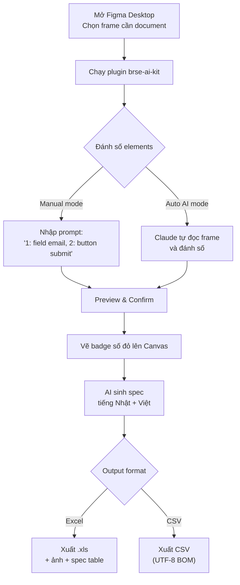

# Kit 5: brse-ai-kit

> **Basic Design Generator** — Công cụ giúp BrSE sinh tài liệu Basic Design nhanh từ Figma frames với AI support.

---

## Mục đích

`brse-ai-kit` giúp **BrSE (Business Requirement Specialist)** tạo tài liệu Basic Design:

- Tự động đánh số UI elements trên Figma frame
- Sinh spec tiếng Nhật + tiếng Việt bằng Claude API
- Xuất Excel Basic Design (.xls + ảnh + spec table)
- Hoặc xuất CSV (UTF-8 BOM cho Excel Nhật)

---

## Hai cách dùng

### Cách 1: Figma Plugin (chính)

Plugin chạy trực tiếp trong Figma Desktop, tự đánh số và sinh spec.

### Cách 2: Claude Desktop + Figma Connector (phụ)

Dùng Claude Desktop với project instructions để sinh Basic Design từ Figma URL.

---

## Cài đặt Figma Plugin

### Yêu cầu

- Figma Desktop app (bắt buộc — không chạy trên web)
- Claude API key
- Node.js (nếu muốn build từ source)

### Cài plugin

1. Mở Figma Desktop
2. Menu **Plugins** → **Development** → **Import plugin from manifest**
3. Chọn file `brse-ai-kit/figma-plugin/manifest.json`

### Cấu hình API key

1. Mở plugin trong Figma
2. Vào Settings → nhập Claude API key
3. Chọn model (Claude Sonnet mặc định)

---

## Flow sử dụng



---

## Cấu trúc kit

```
brse-ai-kit/
├── README.md
├── figma-plugin/
│   ├── manifest.json           ← Plugin manifest
│   ├── src/
│   │   └── ui.html             ← Plugin UI
│   ├── dist/
│   │   └── code.js             ← Compiled plugin logic
│   ├── package.json
│   ├── README.md
│   ├── AI_WORKFLOW.md          ← Chi tiết flow AI
│   └── guidelines/
│       └── (hướng dẫn cài đặt)
├── guidelines/
│   ├── Hướng dẫn sử dụng Claude tạo BD.md
│   └── (screenshots + video)
└── templates/
    ├── WORKFLOW_GUIDE.html
    └── Master_Basic_design_xlsx_V1.0.xlsx
```

---

## Output Basic Design

### Excel output bao gồm

| Sheet | Nội dung |
|-------|---------|
| Overview | Tên screen, mô tả tổng quan |
| Business Overview | Nghiệp vụ liên quan |
| Screen Overview | Sơ đồ layout + số đánh |
| Layout | Cấu trúc layout chi tiết |
| Item List | Danh sách tất cả UI elements |
| Input | Quy tắc input cho mỗi field |
| Validation | Validation rules |
| Error Messages | Danh sách error messages |
| Business Rules | Business rules áp dụng |
| Processing Flow | Luồng xử lý (success + error) |
| Notes | Ghi chú đặc biệt |

---

## Cách 2: Claude Desktop Setup

### Tạo Project trong Claude Desktop

1. Mở Claude Desktop
2. **Projects** → **New Project**
3. **Project Name:** `Basic Design Generator`

### Project Instructions

Dán nội dung từ `guidelines/Introductions.md` vào Project Instructions.

### Project Knowledge

Upload các file:
- `Validation.md` — Validation rules mặc định
- `Error message.md` — Error message templates
- `Business rules.md` — Common business rules

### Sử dụng

```
User: [Dán Figma URL đã đánh số]

Claude sẽ sinh:
- Screen Overview
- Item List với spec tiếng Nhật + Việt
- Input rules, Validation, Error messages
- Business rules, Processing flow
```

---

## Tips & Best Practices

!!! tip "Figma frame chuẩn"
    - Frame ở chế độ **desktop** hoặc **mobile** cụ thể
    - Tên layer trong Figma rõ ràng (vd: `btn-submit`, `input-email`)
    - Không có layer ẩn không cần thiết

!!! info "Auto vs Manual mode"
    - **Auto AI**: phù hợp khi frame có nhiều elements, muốn tiết kiệm thời gian
    - **Manual**: phù hợp khi cần kiểm soát chính xác từng element được đánh số

!!! warning "Giới hạn"
    - Plugin chỉ chạy trên Figma Desktop, không chạy trên web
    - Tối đa ~50 elements per frame để AI đánh số chính xác
    - CSV output dùng UTF-8 BOM để Excel Nhật đọc được tiếng Nhật
