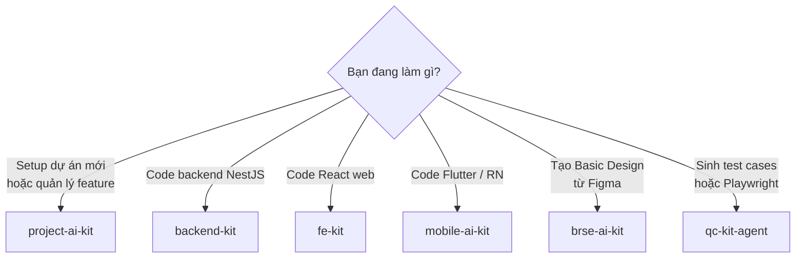

# So sánh tất cả Kits

## Bảng tổng quan

| Kit | Mục đích chính | Dành cho | Độc lập? |
|-----|---------------|---------|---------|
| [project-ai-kit](project-ai-kit.md) | Orchestrate toàn bộ dự án theo BMAD | Toàn team | ✅ (kit chính) |
| [backend-kit](backend-kit.md) | Phát triển NestJS API chuyên sâu | Backend Dev | ✅ |
| [fe-kit](fe-kit.md) | Phát triển React Web chuyên sâu | Frontend Dev | ✅ |
| [mobile-ai-kit](mobile-ai-kit.md) | Flutter + React Native | Mobile Dev | ✅ |
| [brse-ai-kit](brse-ai-kit.md) | Tạo Basic Design từ Figma | BrSE | ✅ |
| [qc-kit-agent](qc-kit-agent.md) | Sinh & quản lý test cases | QC Engineer | ✅ |

---

## Chọn Kit theo task



---

## Tương quan giữa các Kits

### project-ai-kit tích hợp tất cả

`project-ai-kit` là kit trung tâm — nó embed hoặc reference logic của các kit còn lại:

- **QC pipeline** (từ qc-kit) → tích hợp vào Phase 2b, Phase 7
- **Backend/FE/Mobile skills** → Dev agents trong project-ai-kit reference coding style từ backend/fe/mobile kit
- **BrSE** → output là Figma URL, được điền vào SPEC trong Phase 2c

### Dùng cùng lúc nhiều kit

Dự án thực tế thường dùng **project-ai-kit + 2-3 kit chuyên biệt**:

```
project-ai-kit   → Orchestration (BA, PM, Tech Lead, QC, QA)
backend-kit      → Backend dev sessions
fe-kit           → Frontend dev sessions
qc-kit-agent     → QC sessions (sinh TC riêng biệt)
```

---

## So sánh chi tiết

### Cấu trúc commands

| Kit | Số agents | Số commands chính | MCP cần |
|-----|----------|------------------|---------|
| project-ai-kit | 12 | 15+ | tilth, Playwright, Figma |
| backend-kit | 5 | 9 | tilth, codegraph |
| fe-kit | 5 | 5 | tilth |
| mobile-ai-kit | N/A | 6 workflows | codegraph |
| brse-ai-kit | N/A | Plugin UI | Figma API |
| qc-kit-agent | N/A | 7 | Playwright |

### Tech stack mỗi kit

| Kit | Stack chính |
|-----|------------|
| backend-kit | NestJS + TypeORM + PostgreSQL + Redis |
| fe-kit | React 19 + Vite 7 + TanStack Query v5 + Redux Toolkit v2 + Ant Design v6 + TailwindCSS v4 |
| mobile-ai-kit (Flutter) | Dart + hooks_riverpod 3.x + Retrofit+Dio + auto_route + freezed |
| mobile-ai-kit (RN) | TypeScript + Redux Toolkit + RTK Query + React Navigation |

---

## Kit không dùng được khi nào?

| Kit | Không phù hợp với |
|-----|-----------------|
| project-ai-kit | Dự án cá nhân / không có team |
| backend-kit | Stack khác NestJS (Django, Rails...) |
| fe-kit | Stack khác React (Vue, Angular, Next.js thuần...) |
| mobile-ai-kit | Expo managed workflow (cần bare workflow) |
| brse-ai-kit | Không có Figma Desktop app |
| qc-kit-agent | Không có test cases / chỉ cần unit test |
