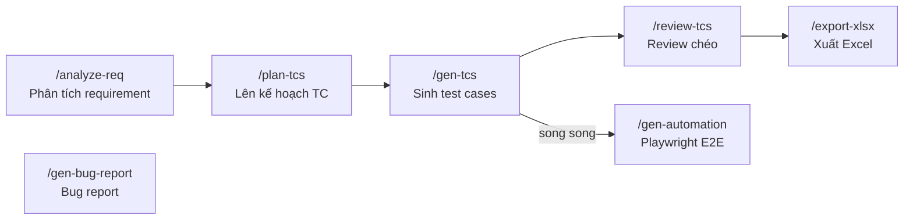

# Kit 6: qc-kit-agent

> **QC Testing Specialist** — Pipeline sinh manual test cases theo RBT và automation Playwright E2E.

---

## Mục đích

`qc-kit-agent` cung cấp quy trình **Risk-Based Testing (RBT)** đầy đủ:

- Phân tích requirement → extract Acceptance Criteria
- Lên kế hoạch test per screen với risk level
- Sinh manual test cases chi tiết
- Review chéo test cases (≥2 QC)
- Xuất Excel theo template công ty
- Sinh Playwright E2E automation scripts
- Chuẩn hóa bug reports

---

## Pipeline 5 bước



**Automation và Bug Report chạy độc lập**, không cần đợi `/review-tcs` hay `/export-xlsx`.

---

## Commands chi tiết

### `/analyze-req`

**Input:** Spec, Figma URL, Google Docs, Backlog ticket, .md file  
**Output:** `<docs>/test-cases/<module>/analysis.md`

Bao gồm:
- Danh sách tất cả Acceptance Criteria từ nguồn
- Ambiguities cần clarify với BA/PM
- Assumptions
- Mapping AC → screen/component

```bash
/analyze-req docs/features/login/SPEC.md
# hoặc
/analyze-req https://figma.com/file/...
```

---

### `/plan-tcs`

**Input:** `analysis.md`  
**Output:** `<docs>/test-cases/<module>/plan-tcs.md`

Bao gồm:
- Strategy per screen (theo `screen_strategy` skill)
- Risk level: Critical / High / Medium / Low
- Test types: functional, boundary, negative, edge case
- Component checklist (form, table, modal...)
- Platform-specific dimensions (web/app)

!!! warning "Bắt buộc chạy trước /gen-tcs"
    `/gen-tcs` sẽ tự chain `/analyze-req → /plan-tcs` nếu chưa có, nhưng kết quả tốt hơn khi chạy riêng để review plan.

---

### `/gen-tcs`

**Input:** `plan-tcs.md` (auto-chain nếu chưa có)  
**Output:** `<docs>/test-cases/<module>/test-cases.md`

Format mỗi test case:

```markdown
## TC-001: Login với email hợp lệ

| Field | Value |
|-------|-------|
| ID | TC-001 |
| Module | Login |
| Priority | Critical |
| Type | Functional - Positive |
| Precondition | User có tài khoản đã đăng ký |
| Steps | 1. Mở trang login\n2. Nhập email hợp lệ\n3. Nhập password đúng\n4. Click Login |
| Expected Result | Redirect về trang Home, hiển thị tên user |
| AC Reference | AC-01 |
```

**Self-check sau khi sinh:**
- Mỗi AC có ít nhất 1 TC positive + 1 TC negative
- Critical components có boundary value tests
- Platform-specific dimensions được cover

---

### `/review-tcs`

**Input:** `test-cases.md`  
**Output:** `review_report.md`

8 tiêu chí review:

| Tiêu chí | Mức độ |
|---------|--------|
| AC coverage đầy đủ | Critical |
| Steps rõ ràng, không ambiguous | Critical |
| Expected result measurable | Critical |
| Positive + Negative cases | Major |
| Boundary values | Major |
| Platform dimensions | Major |
| Data dependencies | Minor |
| Naming convention | Minor |

!!! tip "Dùng khi có ≥2 QC"
    Review chéo — QC1 sinh TC, QC2 review. Không tự review TC của mình.

---

### `/export-xlsx`

**Input:** `test-cases.md` + platform (`web` hoặc `app`)  
**Output:** `test-cases.xlsx` theo template công ty

```bash
/export-xlsx docs/test-cases/login/test-cases.md web
/export-xlsx docs/test-cases/checkout/test-cases.md app
```

Dùng Python script `scripts/md_to_xlsx.py` với template:
- `template/Web_V3.0.xlsx`
- `template/App_V3.0.xlsx`

---

### `/gen-automation`

**Input:** `test-cases.md`  
**Output:** Playwright Page Object + Test scripts

```
tests/
├── pages/
│   └── LoginPage.ts        ← Page Object
├── tests/
│   └── login.spec.ts       ← Test specs
└── utils/
    └── helpers.ts
```

**Flow:**
1. Đọc `test-cases.md`
2. Dùng Playwright MCP để recon DOM thật (chụp screenshot, inspect elements)
3. Sinh Page Object + Test scripts
4. Chạy test
5. Auto-heal nếu lỗi (tối đa 5 vòng)

!!! info "Cần Playwright MCP"
    Playwright MCP phải được cấu hình trong `.claude/settings.json` để recon DOM thật.

---

### `/gen-bug-report`

**Input:** Mô tả lỗi tự nhiên  
**Output:** Bug report chuẩn

```bash
/gen-bug-report "Sau khi cancel đơn hàng, trạng thái vẫn hiển thị 'Đang xử lý' không chuyển sang 'Đã hủy'"
```

**Output format:**

```markdown
## [BUG] Cancel Order - Status không cập nhật sau khi cancel

| Field | Value |
|-------|-------|
| Type | Functional Bug |
| Severity | High |
| Priority | High |
| Module | Order Management |
| Platform | Web |
| Environment | STG |
| Steps to Reproduce | 1. Login...\n2. Vào trang đơn hàng...\n3. Cancel đơn hàng\n4. Kiểm tra trạng thái |
| Expected | Status chuyển sang "Đã hủy" |
| Actual | Status vẫn hiển thị "Đang xử lý" |
| Frequency | 100% reproduced |
```

---

## Cấu trúc kit

```
qc-kit-agent/
├── README.md
├── template/
│   ├── Web_V3.0.xlsx       ← Excel template cho web TC
│   └── App_V3.0.xlsx       ← Excel template cho app TC
└── .claude/
    ├── commands/
    │   ├── analyze-req.md
    │   ├── plan-tcs.md
    │   ├── gen-tcs.md
    │   ├── review-tcs.md
    │   ├── gen-automation.md
    │   ├── export-xlsx.md
    │   └── gen-bug-report.md
    ├── scripts/
    │   └── md_to_xlsx.py   ← Python: TC .md → .xlsx
    └── skills/
        ├── rbt_manual_testing/    ← RBT pipeline core
        ├── requirements_analyzer/ ← Extract AC từ docs
        ├── screen_strategy/       ← Strategy per screen archetype
        ├── testing_dimensions/    ← Platform-specific testing
        ├── component_checklist/   ← Behavior checklist per component
        ├── automation_engineer/   ← Playwright generation
        └── bug_reporter/          ← Bug report standardization
```

---

## Cài đặt

```bash
cp -r /path/to/qc-kit-agent/.claude my-project/.claude

# Nếu cần Playwright automation
# Cấu hình Playwright MCP trong .claude/settings.json
```

---

## Risk Levels

| Level | Ý nghĩa | Số TC tối thiểu |
|-------|---------|----------------|
| Critical | Lỗi → không dùng được app | 5+ TC (all paths) |
| High | Lỗi → feature chính broken | 3+ TC |
| Medium | Lỗi → inconvenient | 2+ TC |
| Low | Lỗi → cosmetic | 1+ TC |
