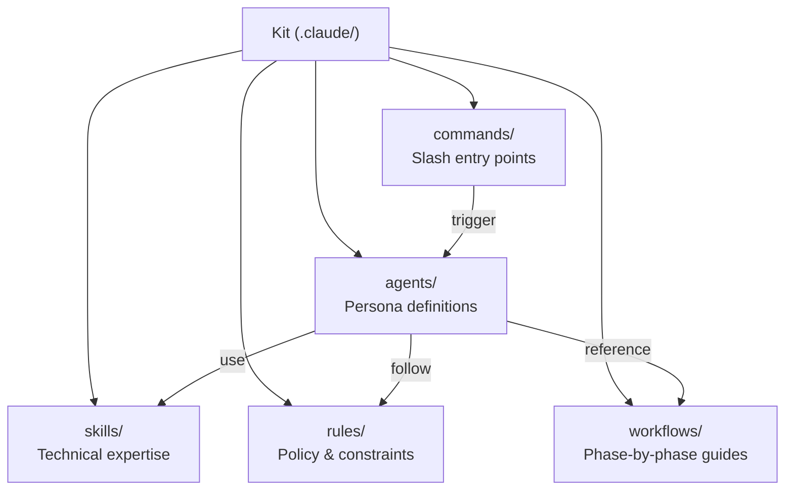
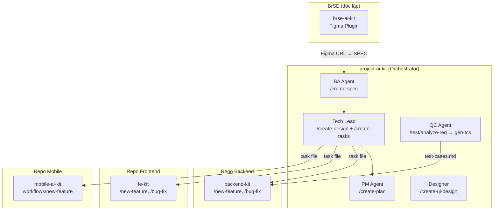
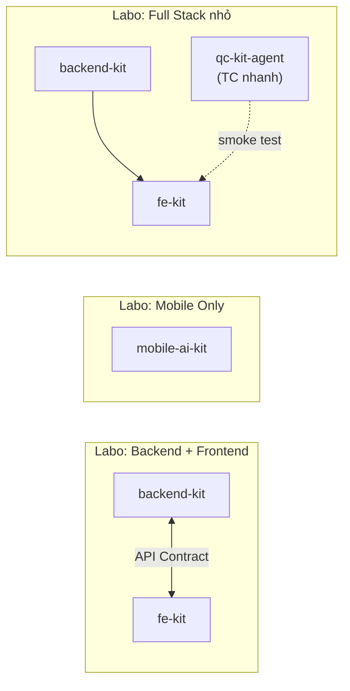
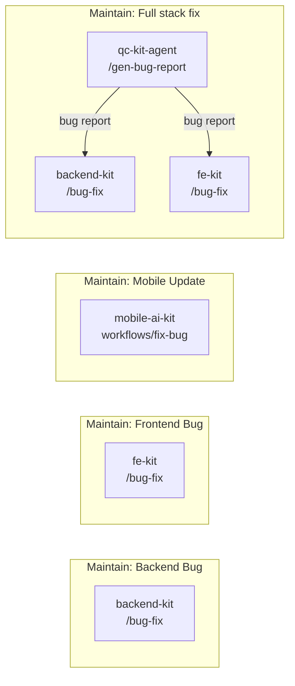

# Kiến trúc Monorepo

**Dipro AI Kit** được tổ chức theo dạng **monorepo** — một repo chứa 6 kit độc lập, mỗi kit có thể dùng standalone hoặc kết hợp với nhau.

---

## Cấu trúc thư mục

```
dipro-ai-kit/
├── project-ai-kit/          ← KIT 1: Orchestration toàn dự án
│   ├── CLAUDE.md            ← Entrypoint, load POLICIES + AGENTS
│   ├── POLICIES.md          ← AI behavior policy chung
│   ├── AGENTS.md            ← Project ecosystem (điền qua /init-kit)
│   ├── ai-agents-workflow.md
│   ├── Automation_Test.md
│   ├── template/            ← Excel templates QC (Web/App V3.0)
│   └── .claude/
│       ├── agents/          ← 12 sub-agent definitions
│       ├── commands/        ← Slash command entry points
│       ├── skills/          ← Technical & process skills
│       ├── context/         ← Business/technical memory
│       ├── rules/           ← Coding style, security, git workflow...
│       ├── scripts/         ← md_to_xlsx.py
│       ├── workflows/       ← BMAD phase workflows
│       └── templates/       ← MkDocs templates
│
├── backend-kit/             ← KIT 2: NestJS Backend
│   ├── README.md
│   ├── guideline/
│   └── .claude/
│       ├── agents/          ← 5 agents (analyst, architect, dev, tester, reviewer)
│       ├── commands/        ← /new-feature, /bug-fix, /generate-api...
│       ├── skills/          ← nestjs-*, postgresql, redis-*, security...
│       └── tools/           ← codegraph, understand-anything
│
├── fe-kit/                  ← KIT 3: React Frontend
│   ├── README.md
│   └── .claude/
│       ├── agents/          ← 5 agents
│       ├── commands/        ← /new-feature, /bug-fix, /code-review...
│       └── skills/          ← 90+ skills (react-*, tailwind-*, form-*...)
│
├── mobile-ai-kit/           ← KIT 4: Flutter + React Native
│   ├── README.md
│   ├── guideline/           ← step1-3 setup guide
│   ├── docs/                ← ADR (Architecture Decision Records)
│   └── .claude/
│       ├── CLAUDE.md        ← (symlink trong project)
│       ├── rules/           ← flutter_common_rules, reactNative_common_rules...
│       ├── workflows/       ← fix-bug, new-feature, investigate, refactor...
│       ├── skills/          ← flutter-expert, flutter-review...
│       └── tools/
│
├── brse-ai-kit/             ← KIT 5: Basic Design
│   ├── README.md
│   ├── figma-plugin/        ← Figma plugin source
│   │   ├── manifest.json
│   │   ├── src/ui.html
│   │   └── dist/code.js
│   ├── guidelines/
│   └── templates/           ← Excel Basic Design template
│
└── qc-kit-agent/            ← KIT 6: QC Testing
    ├── README.md
    ├── template/            ← Excel TC templates (Web/App V3.0)
    └── .claude/
        ├── commands/        ← /analyze-req, /plan-tcs, /gen-tcs...
        ├── scripts/         ← md_to_xlsx.py
        └── skills/          ← rbt_manual_testing, automation_engineer...
```

---

## Thành phần của một Kit

Mỗi kit được tổ chức theo cùng một pattern:



| Thành phần | Vai trò | Ai sửa |
|-----------|---------|--------|
| `agents/` | Định nghĩa persona + quy trình chi tiết | Kit maintainer |
| `commands/` | Entry point 5-8 dòng, trỏ về agent | Kit maintainer |
| `skills/` | Technical expertise load on-demand | Kit maintainer |
| `rules/` | Policy, coding style, security | Kit maintainer |
| `workflows/` | Phase-by-phase workflow guides | Kit maintainer |

!!! tip "Nguyên tắc thiết kế"
    **Agent = Single Source of Truth.** Command chỉ là thin wrapper 5-8 dòng trỏ về agent. Khi cần sửa quy trình → chỉ sửa file agent, không sửa command.

---

## Cách các Kit phối hợp theo loại dự án

### Project Base — Full BMAD

Dự án mới xây từ đầu, có đầy đủ BA → Dev → QC → Deploy. `project-ai-kit` làm orchestrator trung tâm, các kit chuyên biệt chạy trong từng repo.



---

### Labo — Khám phá & Prototype

Dự án ngắn hạn, thử nghiệm công nghệ hoặc làm POC. Không cần full BMAD — chỉ kết hợp **1–3 kit** tùy stack cần dùng.



| Labo type | Kits dùng |
|-----------|----------|
| API prototype | backend-kit |
| UI prototype | fe-kit hoặc mobile-ai-kit |
| Full stack nhỏ | backend-kit + fe-kit |
| Có test nhanh | + qc-kit-agent |
| Cần Basic Design | + brse-ai-kit |

---

### Maintain — Bảo trì & Bug Fix

Dự án đang vận hành, chủ yếu fix bug và cải thiện tính năng nhỏ. Không cần BA/PM/Designer — chỉ dùng **kit chuyên biệt** theo repo cần sửa.



| Maintain type | Kits dùng |
|---------------|----------|
| Backend bug/hotfix | backend-kit |
| Frontend bug/hotfix | fe-kit |
| Mobile bug/hotfix | mobile-ai-kit |
| Cross-layer bug | backend-kit + fe-kit (hoặc mobile-ai-kit) |
| Có bug report chuẩn | + qc-kit-agent (`/gen-bug-report`) |

---

### Tổng hợp theo loại dự án

| | Project Base | Labo | Maintain |
|-|:---:|:---:|:---:|
| project-ai-kit | ✅ Bắt buộc | ❌ | ❌ |
| backend-kit | ✅ | Tùy | ✅ |
| fe-kit | ✅ | Tùy | ✅ |
| mobile-ai-kit | ✅ | Tùy | ✅ |
| brse-ai-kit | ✅ | Tùy | ❌ |
| qc-kit-agent | ✅ | Tùy | Tùy |

---

## Cách cài đặt Kit

### Cách 1: Copy trực tiếp (Backend / Frontend)

```bash
# Copy .claude folder vào project
cp -r dipro-ai-kit/backend-kit/.claude my-project/.claude
```

### Cách 2: Symlink qua git submodule (Mobile)

```bash
# Thêm dipro-ai-kit như một submodule
git submodule add -b main git@github.com:dipro-vn/dipro-ai-kit.git tools/dipro-ai-kit

# Tạo symlinks
mkdir -p .claude
ln -s ../tools/dipro-ai-kit/mobile-ai-kit/.claude/CLAUDE.md .claude/CLAUDE.md
ln -s ../tools/dipro-ai-kit/mobile-ai-kit/.claude/rules .claude/rules
ln -s ../tools/dipro-ai-kit/mobile-ai-kit/.claude/workflows .claude/workflows
ln -s ../tools/dipro-ai-kit/mobile-ai-kit/.claude/skills .claude/skills
```

### Cách 3: Figma Plugin (BrSE)

Cài plugin từ `brse-ai-kit/figma-plugin/manifest.json` vào Figma Desktop.

---

## MCP Tools được tích hợp

| Tool | Kit dùng | Chức năng |
|------|---------|-----------|
| `tilth` MCP | project, backend, fe | Code search & analysis |
| Playwright MCP | qc-kit, project-ai-kit | E2E test automation |
| Figma MCP | brse-kit, project-ai-kit | Design reading |
| CodeGraph / Understand-Anything | backend, mobile | Codebase navigation |
