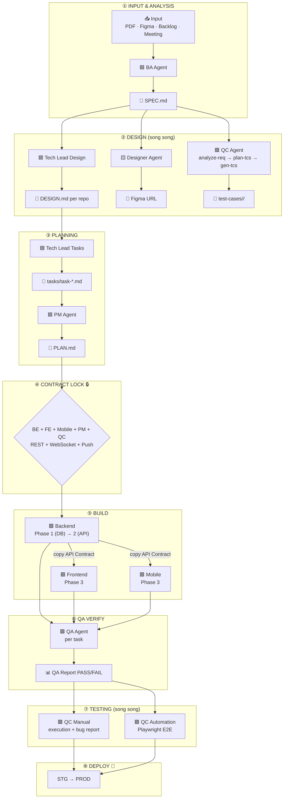

# BMAD Workflow — Flow tổng thể

**BMAD** (BA → Make → Apply → Deploy) là quy trình 8 phase kiểm soát toàn bộ vòng đời feature, từ khi nhận requirement đến khi deploy production.

---

## Sơ đồ tổng thể



---

## Chi tiết 8 Phases

### Phase 0 — Setup `/init-kit`

**Mục tiêu:** Điền thông tin dự án vào `AGENTS.md` một lần duy nhất.

```bash
claude
/init-kit
```

Agent sẽ hỏi 8 câu:

| Câu hỏi | Ví dụ |
|---------|-------|
| Tên dự án + domain | `ecommerce-japan`, quản lý bán hàng B2B |
| Docs root path | `my-project-docs/docs` |
| Danh sách repo + path + vai trò | backend, frontend, mobile |
| Epic code per repo | E01, E02, E03 |
| Actors/personas | Admin, Customer, Driver |
| Payment gateway | elepay, Alipay |
| Cặp repo dễ nhầm | web-admin vs web-shop |
| Cross-repo features | Payment, Auth JWT |

**Output:** `AGENTS.md` được điền đầy đủ

---

### Phase 1 — Discovery `/create-spec`

**Agent:** BA Agent  
**Input:** Requirement (tự nhiên / Figma URL / Backlog ticket / PDF)  
**Output:** `<DOCS_ROOT>/features/<feature>/SPEC.md`

**SPEC.md bao gồm:**
- Background & Objective
- In Scope / Out of Scope
- Actors & Flows
- Acceptance Criteria (per actor)
- Data Model sơ bộ
- Q&A / Ambiguities

---

### Phase 2 — Design (3 agent chạy song song)

#### 2a. Tech Lead Design `/create-design`

**Output:** `<DOCS_ROOT>/features/<feature>/<repo>/DESIGN.md`

Bao gồm: Architecture decision, API endpoints, Database schema, Component breakdown, Cross-repo dependencies.

#### 2b. QC Pipeline `/test/analyze-req` → `/test/plan-tcs` → `/test/gen-tcs`

**Output:** `<DOCS_ROOT>/features/<feature>/test-cases/<module>/`
- `analysis.md` — Extracted ACs + ambiguities
- `plan-tcs.md` — Strategy per screen, risk levels
- `test-cases.md` — Full manual test cases

#### 2c. Designer `/create-ui-design`

**Output:** Figma frames + URL → điền vào `SPEC.md ## Screens`

---

### Phase 3 — Planning

#### Tech Lead Tasks `/create-tasks`

**Output:** `<DOCS_ROOT>/features/<feature>/<repo>/tasks/task-X-Y.md`

Mỗi task file chứa: Goal, Scope, File list, Steps, Estimate, Dependencies, Definition of Done.

#### PM `/create-plan` + `/create-backlog`

**Output:** `<DOCS_ROOT>/features/<feature>/PLAN.md` + Backlog issues

---

### Phase 4 — Contract Lock 🔒

**Gate bắt buộc** trước khi FE/Mobile bắt đầu build.

!!! danger "Không được skip"
    Tất cả BE + FE + Mobile + PM + QC phải confirm:
    - REST API Contract (method, path, request/response)
    - WebSocket events (nếu có)
    - Push notification payloads (nếu có)

---

### Phase 5 — Build

**Thứ tự bắt buộc:**

```
BE Phase 1 (Migration + Entity)
    ↓
BE Phase 2 (Controller + Service + API Contract table)
    ↓ copy API Contract
FE Phase 3  ──┐  (chạy song song)
Mobile Phase 3─┘
```

!!! info "Memory Update Gate"
    Sau mỗi Dev task, **bắt buộc** cập nhật overview docs tại `<DOCS_ROOT>/<layer>/<repo>/overview/` khi thay đổi endpoint/entity/pattern.

---

### Phase 6 — QA Verify (per task)

**Agent:** QA Agent  
**Trigger:** `"Hãy là QA, verify task: <path/to/task.md>"`

**QA Report:**
- Unit test coverage check
- AC checklist
- PASS → chuyển sang task tiếp
- FAIL → Dev fix loop

---

### Phase 7 — Testing (2 luồng song song)

#### 7a. QC Manual

```bash
/test/generate_test_execution_checklist
/test/gen-bug-report "Mô tả lỗi"
```

#### 7b. QC Automation (Playwright E2E)

```bash
/gen-automation  # từ test-cases.md → Playwright scripts
```

Auto-heal loop: chạy → lỗi → sửa (tối đa 5 vòng)

---

### Phase 8 — Deploy

STG → PROD, sau khi tất cả test PASS.

---

## On-demand Commands

| Command | Khi nào dùng |
|---------|-------------|
| `/test/review-tcs` | Có ≥2 QC review chéo (8 tiêu chí) |
| `/test/export-xlsx <path> web\|app` | Bàn giao Excel cho client |
| `/test/generate_regression_suite` | Sau code change lớn |
| `/create-feature <feature> [build]` | Shortcut chạy toàn pipeline |

---

## Phân quyền theo Phase

| Action | BA | TL | PM | QC | QA | Designer | Dev |
|--------|:--:|:--:|:--:|:--:|:--:|:--------:|:---:|
| Sửa `.md` | ✅ | ✅ | ✅ | ✅ | ✅* | ✅** | ✅ |
| Sửa source code | ❌ | ❌ | ❌ | ❌ | ❌ | ❌ | ✅ |
| Chạy test | ❌ | ❌ | ❌ | ✅ | ✅ | ❌ | ✅ |
| Git commit | ❌ | ❌ | ❌ | ❌ | ❌ | ❌ | ❌*** |
| Git push | ❌ | ❌ | ❌ | ❌ | ❌ | ❌ | ❌ |

> \* QA chỉ sửa QA Report  
> \*\* Designer chỉ điền Figma link vào `SPEC.md ## Screens`  
> \*\*\* Dev commit chỉ khi user yêu cầu rõ ràng
