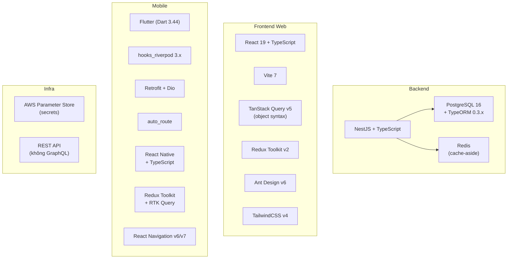

# Tech Stack cố định

Các ràng buộc tech stack **không thể thương lượng** trong Dipro AI Kit. Thay đổi chỉ được phép khi có quyết định rõ ràng từ Tech Lead + PM và cập nhật vào `/init-kit`.

---

## Stack Overview



---

## Backend Stack

| Layer | Bắt buộc | Version | Không được dùng |
|-------|---------|---------|----------------|
| Framework | NestJS + TypeScript | Latest | Express thuần, Fastify, Django |
| Database ORM | TypeORM | 0.3.x | Prisma, Sequelize, Knex |
| Database | PostgreSQL | 16+ | MySQL, MongoDB, SQLite |
| Cache | Redis | Latest | Memcached, in-memory |
| Auth | JWT (passport-jwt) | Latest | Session-based, API key only |
| Test | Jest + Supertest | Latest | Vitest, Mocha |
| API Style | REST | — | GraphQL, gRPC, tRPC, WebSocket (ngoài realtime) |
| Secrets | AWS Parameter Store | — | `.env` production, hard-code |

### TypeORM 0.3.x — Known Issues

!!! warning "orderBy bug"
    TypeORM 0.3.x có known bug với dynamic `orderBy` có thể gây N+1 hoặc SQL injection. **BẮT BUỘC** dùng whitelist:
    
    ```typescript
    const ORDER_MAP = { createdAt: 'e.createdAt', status: 'e.status' };
    qb.orderBy(ORDER_MAP[dto.orderBy] ?? 'e.createdAt', 'DESC');
    ```

---

## Frontend Web Stack

| Layer | Bắt buộc | Version | Không được dùng |
|-------|---------|---------|----------------|
| UI Framework | React + TypeScript | 19 | Vue, Angular, Svelte |
| Build Tool | Vite | 7 | CRA, Webpack thuần |
| Server State | TanStack Query | v5 (object syntax) | Redux cho server data |
| Client State | Redux Toolkit | v2 | Context API cho global/auth |
| Forms | react-hook-form + yup | Latest | Formik, AntD Form.Item rules |
| UI Components | Ant Design | v6 | MUI, Chakra |
| Routing | react-router-dom | v7 | Next.js router |
| Styling | TailwindCSS | v4 | CSS Modules, styled-components |

### TanStack Query v5 — Object Syntax ONLY

```typescript
// ✅ v5 object syntax — BẮT BUỘC
useQuery({ queryKey: ['orders'], queryFn: fetchOrders })
useMutation({ mutationFn: cancelOrder })
useInfiniteQuery({ queryKey: [...], queryFn: ... })

// ❌ v4 positional — KHÔNG được dùng
useQuery(['orders'], fetchOrders)
```

### Ant Design v6 — Breaking Changes từ v5

```typescript
// ✅ v6 date picker
import { DatePicker } from 'antd';
// Import style qua CSS-in-JS (không import antd/dist/antd.css)

// Check migration guide trước khi nâng cấp từ v5
```

---

## Mobile Stack — Flutter

| Layer | Bắt buộc | Version | Không được dùng |
|-------|---------|---------|----------------|
| Language | Dart | 3.44+ | — |
| Framework | Flutter | 3+ | — |
| State Management | hooks_riverpod | 3.0.1 | Provider, BLoC, GetX, MobX |
| HTTP | Retrofit + Dio | Latest | `http` package, `chopper` |
| Routing | auto_route | Latest | go_router, Navigator.push trực tiếp |
| Immutable State | freezed | Latest | Equatable |
| Sizing | flutter_screenutil | Latest | Hard-code pixel |

### Strict Analysis Options

```yaml
# analysis_options.yaml bắt buộc
analyzer:
  strong-mode:
    implicit-casts: false
    implicit-dynamic: false
linter:
  rules:
    - require_trailing_commas
    - unawaited_futures
    - avoid_print
    - prefer_const_constructors
    - prefer_const_literals_to_create_immutables
```

---

## Mobile Stack — React Native

| Layer | Bắt buộc | Không được dùng |
|-------|---------|----------------|
| Language | TypeScript (strict) | JavaScript |
| State | Redux Toolkit | MobX, Context API |
| Server State | RTK Query | React Query (dùng RTK Query) |
| HTTP | Axios hoặc RTK Query | Fetch thuần |
| Routing | React Navigation v6/v7 | react-native-navigation (chỉ khi cần) |

---

## Secrets & Config

| Environment | Storage | Không được dùng |
|-------------|---------|----------------|
| Production | AWS Parameter Store | `.env.production`, hard-code |
| Staging | AWS Parameter Store | `.env.staging`, hard-code |
| Development | `.env.local` (gitignored) | Hard-code trong source |
| CI/CD | GitHub Secrets / AWS | Hardcode trong workflow |

---

## Mobile Version Convention

```
DEV:  0.0.<build_number>    # ví dụ: 0.0.42
STG:  0.1.<build_number>    # ví dụ: 0.1.42
PROD: 1.0.<build_number>    # ví dụ: 1.0.42
```

**Rules:**
- Không đảo ngược (DEV < STG < PROD)
- Không skip STG để lên thẳng PROD
- Build number tăng dần, không reset

---

## Thay đổi stack

Muốn thay đổi bất kỳ item nào trong bảng trên:

1. Đề xuất với Tech Lead + PM
2. Cập nhật quyết định vào `AGENTS.md` và `.claude/rules/stack-constraints.md`
3. Cập nhật `/init-kit` template cho dự án mới

**Không được** tự ý thêm package/library mới mà chưa được Tech Lead duyệt.
