# project-ai-kit — Template BMAD Agent Kit

> Bộ khung multi-agent AI (BA → Tech Lead → PM → Dev → QC → QA → Designer) theo mô hình BMAD. Pull kit này vào 1 dự án mới, bỏ repo source code vào đúng chỗ, chạy 1 lệnh setup, là có ngay bộ agent/command/skill hoạt động cho toàn bộ vòng đời feature (SPEC → DESIGN → task → implement → QA → deploy).

---

## Quy trình từ A → Z

### Bước 0 — Cài & đăng nhập Claude Code CLI

Kit này chạy trên **Claude Code CLI** — cần cài 1 lần trước khi làm gì.

**Yêu cầu:** Node.js ≥ 18 (khuyến nghị dùng `nvm`).

```bash
# Cài Claude Code CLI (global)
npm install -g @anthropic-ai/claude-code

# Kiểm tra
claude --version
```

**Đăng nhập lần đầu:**

```bash
claude    # chạy tại thư mục bất kỳ
```

Lần chạy đầu tiên CLI sẽ mở browser để login bằng Anthropic account (hoặc API key nếu tổ chức dùng key riêng). Sau khi login → thoát bằng `/exit` hoặc `Ctrl+D`, quay lại làm Bước 1.

**Cách dùng cơ bản (ghi nhớ 3 lệnh):**

| Lệnh | Tác dụng |
|---|---|
| `claude` | Mở session interactive tại thư mục hiện tại (default) |
| `/<command>` | Chạy slash command trong session — ví dụ `/init-kit`, `/create-spec`, `/test/gen-tcs` |
| `/exit` | Thoát session (hoặc `Ctrl+D`) |

Trong session có thể trigger agent bằng **natural language** ("hãy là BA, làm SPEC cho login") hoặc **slash command** (`/create-spec login`) — cùng kết quả.

Muốn xem full help / config: gõ `/help` bên trong session, hoặc `claude --help` ngoài shell.

> **Alternative:** Nếu công ty đã cấp Claude Code qua IDE extension (VS Code / JetBrains) hoặc desktop app thì cũng dùng được — chỉ cần mở đúng thư mục `<ten-du-an>` là kit hoạt động. Các bước bên dưới giả định dùng CLI.

---

### Bước 1 — Chuẩn bị thư mục dự án mới

```bash
mkdir <ten-du-an> && cd <ten-du-an>
git init   # nếu chưa có git repo
```

### Bước 2 — Copy kit vào dự án

```bash
# Từ thư mục chứa project-ai-kit (đổi <path-to-kit> cho đúng)
cp -r <path-to-kit>/project-ai-kit/.claude ./.claude
cp -r <path-to-kit>/project-ai-kit/template ./template    # Excel templates cho QC
cp <path-to-kit>/project-ai-kit/CLAUDE.md <path-to-kit>/project-ai-kit/POLICIES.md <path-to-kit>/project-ai-kit/AGENTS.md ./
```

Sau bước này, dự án mới có:

```
<ten-du-an>/
├── CLAUDE.md          ← always-loaded, chỉ import 2 file dưới
├── POLICIES.md         ← AI behavior policy chung (không sửa trừ khi cần đổi rule tổ chức)
├── AGENTS.md           ← project rules — CHƯA điền, sẽ điền ở Bước 4
├── template/           ← Excel templates cho QC test cases (Web/App V3.0)
└── .claude/
    ├── agents/ commands/ skills/ context/ rules/ scripts/ workflows/ settings.json
```

### Bước 3 — Bỏ repo source code vào

Kit **không giả định số lượng hay tên repo cố định** — 1 repo (monorepo) hay N repo (backend + nhiều web + mobile) đều được. Có 2 cách tổ chức, chọn 1:

**Cách A — Nhiều repo con nằm cùng cấp trong dự án** (khuyến nghị nếu có backend + nhiều frontend + mobile):

```
<ten-du-an>/
├── CLAUDE.md / POLICIES.md / AGENTS.md / .claude/    ← kit (Bước 2)
├── <ten-du-an>-repository/       ← thư mục chứa toàn bộ source code
│   ├── <backend-repo>/           ← git clone repo backend vào đây
│   ├── <web-repo-a>/             ← git clone repo web #1 vào đây
│   ├── <web-repo-b>/             ← git clone repo web #2 vào đây (nếu có)
│   └── <mobile-repo>/            ← git clone repo mobile vào đây (nếu có)
└── <ten-du-an>-docs/             ← (optional) repo docs riêng, xem Bước 4 câu 2
    └── docs/features/
```

**Cách B — Kit nằm ngay trong 1 repo duy nhất** (phù hợp dự án nhỏ/monorepo):

```
<ten-du-an>/                       ← chính là git repo source code
├── CLAUDE.md / POLICIES.md / AGENTS.md / .claude/    ← kit (Bước 2)
├── src/ ...                       ← source code dự án
└── docs/features/                 ← docs ngay trong repo, không cần repo riêng
```

`git clone` (hoặc `git submodule add`) từng repo vào đúng vị trí đã chọn — dùng đường dẫn tương đối này khi trả lời câu hỏi ở Bước 4.

### Bước 4 — Chạy setup 1 lần: `/init-kit`

Mở Claude Code tại thư mục `<ten-du-an>`, chạy:

```
/init-kit
```

(hoặc nói tự nhiên: "hãy chạy init kit cho dự án này")

`init-agent` sẽ hỏi ~8 câu — **trả lời dựa trên cấu trúc thư mục đã tạo ở Bước 3**:

1. Tên dự án + mô tả domain nghiệp vụ 1-2 câu
2. Docs root — path thật tới nơi chứa SPEC/DESIGN/PLAN (ví dụ `<ten-du-an>-docs/docs` nếu dùng Cách A, hoặc `docs` nếu dùng Cách B)
3. Danh sách repo: tên, **đường dẫn tương đối thật** (ví dụ `<ten-du-an>-repository/<backend-repo>`), vai trò (`backend`/`frontend`/`mobile`/`other`), stack (Enter để dùng mặc định kit)
4. Epic code cho mỗi repo (tự đặt hoặc để agent tự đánh số)
5. Danh sách actor/persona nghiệp vụ (ai dùng hệ thống, dùng repo nào)
6. Payment/integration đặc thù (nếu có)
7. Cặp repo/khái niệm dễ nhầm lẫn cần lưu ý
8. Feature cross-repo nào chắc chắn sẽ có (optional)


### Bước 5 — Kiểm tra lại kết quả init

Mở `AGENTS.md` → xác nhận bảng Ecosystem/Actors đã điền đúng đường dẫn repo thật (Bước 3). Sai chỗ nào thì sửa tay hoặc chạy lại `/init-kit` để bổ sung.

### Bước 5b — (optional) Setup MkDocs site để duyệt docs

Kit có sẵn template MkDocs để render `<DOCS_ROOT>/features/<feature>/` (SPEC/DESIGN/PLAN/tasks) thành 1 site duyệt được bằng browser — không cần sửa `mkdocs.yml` mỗi khi thêm feature mới (nav tự sinh từ cấu trúc thư mục qua plugin `awesome-pages`).

```bash
# Copy 2 file template vào ĐÚNG cấp với docs_dir (thư mục chứa "docs/"):
# - Cách A (docs repo riêng): root <ten-du-an>-docs/
# - Cách B (docs ngay trong repo): root <ten-du-an>/
cp .claude/templates/mkdocs.yml <đích>/mkdocs.yml
mkdir -p <đích>/docs
cp .claude/templates/docs-index.md <đích>/docs/index.md
```

`/init-kit` (Bước 4) tự điền `<TEN_DU_AN>` trong `mkdocs.yml`/`docs/index.md` nếu 2 file này đã tồn tại tại thời điểm chạy — nếu chưa, tự sửa placeholder `<TEN_DU_AN>` bằng tay.

Cài dependency và chạy site:

```bash
pip install -r .claude/templates/mkdocs-requirements.txt
mkdocs serve   # mở http://localhost:8000
```

### Bước 6 — Bắt đầu vòng đời feature đầu tiên
"hãy là BA, làm SPEC cho \<requirement\>". Từ đây pipeline BMAD tự dẫn dắt qua "Bước tiếp theo" ở cuối mỗi output — không cần nhớ thứ tự lệnh:

```
/create-spec        (BA)         → SPEC.md
/create-design       (Tech Lead)  → DESIGN.md per repo         ┐ chạy song song
/create-ui-design     (Designer)   → Figma frames + URL         ┤ (2b, 2c, 2d)
/test/analyze-req → /test/plan-tcs → /test/gen-tcs (QC)         ┘  → analysis/plan/test-cases.md per module
/create-tasks        (Tech Lead)  → tasks/task-*.md
/create-plan         (PM)         → PLAN.md
"Hãy là Backend/Frontend/Mobile Developer, implement task: <task-x-y.md>"
"Hãy là QA, verify task: <task-x-y.md>"
/test/review-tcs (QC, khi có ≥2 QC review chéo)                 → review_report.md
/test/export-xlsx <test-cases.md> web|app (bàn giao Excel)      → test-cases.xlsx
/test/generate_test_execution_checklist (QC)                    → trước khi deploy
```


**Shortcut chạy cả pipeline 1 lệnh (không PM):**
```
/create-feature <feature> [mô tả]     # Planning: BA → Design → Tasks, dừng ở gate để review
/create-feature <feature> build       # Build: Dev → QA → QC, chạy sau khi đã duyệt Planning
```

Dùng khi muốn chạy nhanh cả pipeline mà không gõ từng lệnh; PM (`/create-plan`, `/create-backlog`) vẫn chạy riêng khi cần timeline/assignee thật.

**Sơ đồ pipeline BMAD — từ yêu cầu đến deploy:**

```mermaid
flowchart TB

    %% ===== STAGE 1 =====

    subgraph S1["① INPUT & ANALYSIS"]

        INPUT["📥 Input
        PDF · Figma · Backlog · Meeting"]

        TRIGGER{"Trigger"}

        NL["💬 Natural Language"]
        CMD["⌨️ /create-spec"]

        BA["🟦 BA Agent"]

        SPEC["📄 SPEC.md"]

        INPUT --> TRIGGER
        TRIGGER --> NL
        TRIGGER --> CMD

        NL --> BA
        CMD --> BA

        BA --> SPEC

    end

    %% ===== STAGE 2 =====

    subgraph S2["② DESIGN (song song)"]

        TLD["🟦 Tech Lead Design"]
        DES["🟨 Designer Agent"]
        QCPIPE["🟪 QC Agent — pipeline 3 bước
        analyze-req → plan-tcs → gen-tcs"]

        DESIGN["📄 DESIGN.md per repo"]
        FIGMA["🎨 Figma URL
        + ## Screens → SPEC"]
        TC["📄 test-cases/<module>/
        analysis · plan-tcs · test-cases"]

        SPEC --> TLD
        SPEC --> DES
        SPEC --> QCPIPE

        TLD --> DESIGN
        DES --> FIGMA
        QCPIPE --> TC

    end

    %% ===== STAGE 3 =====

    subgraph S3["③ PLANNING"]

        TASK["🟦 Tech Lead Tasks"]

        TASKDOC["📄 tasks/task-*.md"]

        PM["🟦 PM Agent"]

        PLAN["📄 PLAN.md"]

        BACKLOG["📋 Backlog"]

        DESIGN --> TASK
        FIGMA --> TASK

        TASK --> TASKDOC

        TASKDOC --> PM

        PM --> PLAN
        PM -. /create-backlog .-> BACKLOG

    end

    %% ===== STAGE 4 =====

    subgraph S4["④ CONTRACT LOCK"]

        LOCK{"🔒 Contract Lock

        BE + FE + Mobile + PM + QC

        REST + WebSocket + Push"}

    end

    PLAN --> LOCK
    BACKLOG -.-> LOCK

    %% ===== STAGE 5 =====

    subgraph S5["⑤ BUILD"]

        BE["🟩 Backend Agent
        Phase 1 (DB) → 2 (API + Contract)"]
        FE["🟩 Frontend Agent
        Phase 3"]
        MOB["🟩 Mobile Agent
        Phase 3"]

        CODE["💻 Working Code
        + API Contract table
        + Memory Update Gate"]

        LOCK --> BE
        BE -. copy API Contract .-> FE
        BE -. copy API Contract .-> MOB

        FIGMA -.-> FE
        FIGMA -.-> MOB

        BE --> CODE
        FE --> CODE
        MOB --> CODE

    end

    %% ===== STAGE 6 =====

    subgraph S6["⑥ VERIFY (QA per task)"]

        QA["🟪 QA Agent"]

        REPORT["📊 QA Report
        PASS / FAIL"]

        CODE --> QA

        TC -.-> QA

        QA --> REPORT

    end

    %% ===== STAGE 7 =====

    subgraph S7["⑦ TESTING (song song)"]

        MANUAL["🟪 QC Manual — lần 2
        execution checklist + gen-bug-report"]

        AUTO["🟪 QC Automation
        Playwright E2E"]

        BUG["📊 Bug Reports"]

        E2E["📊 E2E Report"]

        REPORT --> MANUAL
        REPORT --> AUTO

        TC -.-> MANUAL

        MANUAL --> BUG
        AUTO --> E2E

    end

    %% ===== STAGE 8 =====

    subgraph S8["⑧ DEPLOY"]

        DEPLOY["🚀 STG → PROD"]

    end

    BUG --> DEPLOY
    E2E --> DEPLOY


    %% ===== STYLE =====

    classDef ba fill:#DBEAFE,stroke:#2563EB,color:#1E3A8A
    classDef dev fill:#DCFCE7,stroke:#16A34A,color:#14532D
    classDef qa fill:#F3E8FF,stroke:#9333EA,color:#581C87
    classDef design fill:#FEF3C7,stroke:#D97706,color:#78350F
    classDef artifact fill:#F9FAFB,stroke:#6B7280,color:#111827
    classDef gate fill:#FEE2E2,stroke:#DC2626,color:#7F1D1D

    class BA,TLD,TASK,PM ba
    class BE,FE,MOB dev
    class QCPIPE,QA,MANUAL,AUTO qa
    class DES design

    class SPEC,DESIGN,FIGMA,TC,TASKDOC,PLAN,BACKLOG,CODE,REPORT,BUG,E2E artifact

    class TRIGGER,LOCK gate
```




**On-demand (ngoài pipeline chính, chạy khi cần):**

| Command | Khi nào |
|---|---|
| `/test/review-tcs` | Có ≥2 QC review chéo bộ TC (8 tiêu chí Critical/Major/Minor) |
| `/test/export-xlsx <path> web\|app` | Bàn giao Excel cho client / release theo template công ty |
| `/test/generate_regression_suite` | Sau code change lớn, cần xác định subset TC re-run |
| Delta update | SPEC đổi → re-run `/test/analyze-req` → `plan-tcs` → `gen-tcs` |

### Chạy Automation Test (Playwright E2E)

Hướng dẫn setup repo E2E riêng, cài Playwright, chạy `/qc-automation` và đọc report → `Automation_Test.md`.

---

## Cấu trúc kit

```
project-ai-kit/
├── CLAUDE.md, POLICIES.md, AGENTS.md   ← root docs, always-loaded qua CLAUDE.md
├── README.md            ← guide này — setup A→Z + quy trình feature
├── Automation_Test.md   ← guide riêng — setup + chạy Playwright E2E automation test
├── template/            ← Excel templates cho QC test cases (Web/App V3.0) — dùng bởi /test/export-xlsx
└── .claude/
    ├── agents/       ← persona (BMAD core + init-agent)
    ├── commands/     ← slash command, thin entry point → agent tương ứng (bao gồm QC pipeline /test/analyze-req → plan-tcs → gen-tcs → review-tcs → export-xlsx)
    ├── skills/       ← technical + process skills, load on-demand (bao gồm rbt_manual_testing, component_checklist, testing_dimensions cho QC pipeline)
    ├── context/      ← business/technical memory — phần lớn RỖNG, điền dần qua BA/PM/init-agent
    ├── rules/        ← coding-style, security, git-workflow, stack-constraints, SECURITY.md (files cấm đọc), POLICY.md (IP protection), RELIABILITY.md (no guessing)...
    ├── scripts/      ← md_to_xlsx.py — Python script convert TC .md → .xlsx theo template Web/App
    ├── workflows/    ← bmad-plan-phase.js/bmad-build-phase.js (dùng bởi /create-feature) + pipeline reference + db-connect templates
    └── templates/    ← mkdocs.yml + docs-index.md + mkdocs-requirements.txt (Bước 5b, optional)
```

**Nguyên tắc cốt lõi** (chi tiết trong `POLICIES.md`): không đoán mò · đọc trước hành động sau · stateless (mọi context đọc từ `.md`) · tool-first (tilth thay grep/cat/find) · blast radius check trước khi đổi public interface · phân quyền persona nghiêm ngặt (chỉ Dev sửa source code).
