# AI Agents Workflow — Đọc gì · Thực thi gì · Output gì

> **Mục đích:** tài liệu tra cứu nhanh **cho user/PM (human)** audit từng agent làm gì trong pipeline BMAD. Nội dung tổng hợp từ 12 file trong `.claude/agents/`. Khi sửa workflow của agent nào → **sửa file agent tương ứng, không sửa file này** (sync lại sau).
>
> **Không phải canonical** — canonical là `.claude/agents/<agent>.md`. File này chỉ là bản tổng hợp.
>
> **Vị trí:** đặt ở root `project-ai-kit/` (không phải trong `.claude/`) — cố ý để agents không auto-load. Chỉ human đọc khi cần audit / onboarding developer mới.

---

## 1. Bảng tổng quan — Phase-Gate

| # | Phase | Agent | Trigger | Song song với |
|---|---|---|---|---|
| 0 | Setup | `init-agent` | `/init-kit` (1 lần) | — |
| 1 | Discovery | `ba-agent` | `/create-spec <feature>` | — |
| 2a | Design | `techlead-design-agent` | `/create-design <SPEC.md>` | 2b, 2c |
| 2b | Design | `qc-agent` (manual TC lần 1) | Pipeline: `/test/analyze-req` → `/test/plan-tcs` → `/test/gen-tcs` | 2a, 2c |
| 2c | Design | `designer-agent` | `/create-ui-design <SPEC.md>` | 2a, 2b |
| 3 | Planning | `techlead-tasks-agent` | `/create-tasks <feature/>` | — |
| 4 | Planning | `pm-agent` | `/create-plan <feature/>` (+ optional `/create-backlog`) | — |
| 5a | Build | `backend-agent` | Implement task Phase 1 → 2 | — |
| 5b | Build | (manual) copy API Contract → task-3-x | — | — |
| 5c | Build | `frontend-agent` | Implement task Phase 3 | 5d |
| 5d | Build | `mobile-agent` | Implement task Phase 3 | 5c |
| 5e | Integration | BE + FE + Mobile | task-4-x integration test | — |
| 6 | Verify | `qa-agent` | `"Hãy là QA, verify task: <path>"` | — |
| 7a | Test | `qc-agent` (execution lần 2) | `/test/generate_test_execution_checklist` | 7c |
| 7b | Test | `qc-agent` (regression optional) | `/test/generate_regression_suite` | — |
| 7c | Test | `qc-automation-agent` | `"Hãy là QC Automation, test feature: ..."` | 7a |

> **On-demand (không thuộc phase-gate):** `/test/review-tcs` (deep review khi ≥2 QC) · `/test/export-xlsx <path> web\|app` (Excel bàn giao) · `/test/gen-bug-report` (bug template).

**Handover chain:** natural language (copy-paste vào turn kế tiếp) hoặc slash command — cả hai cùng load file agent.

---

## 2. Nguyên tắc chung

| Rule | Áp dụng cho |
|---|---|
| Bước 1 = đọc context + skill trước khi hành động | Mọi agent |
| Chỉ tạo/sửa `.md` (trừ Dev) | BA, PM, Tech Lead, QC, QA, Designer, QC-Auto |
| `tilth_deps` blast radius BẮT BUỘC trước khi đổi public interface | Tech Lead Design, Tech Lead Tasks, Backend, Frontend, Mobile |
| Không tự đoán khi thiếu context — phải hỏi user | Mọi agent |
| Handover message = natural language + slash command song song | Mọi agent |
| Không commit / push khi user không yêu cầu rõ ràng | Mọi agent (đặc biệt Dev) |

---

## 3. Chi tiết per agent

> Mỗi flowchart mô tả trình tự **Đọc → Query/Check → Thực thi → Handover** cho 1 agent. Chi tiết đầy đủ (danh sách file đọc chính xác, template output, danh sách "Không được làm") → xem `.claude/agents/<agent-name>.md`.

### 3.0 `init-agent` — Kit Setup Assistant

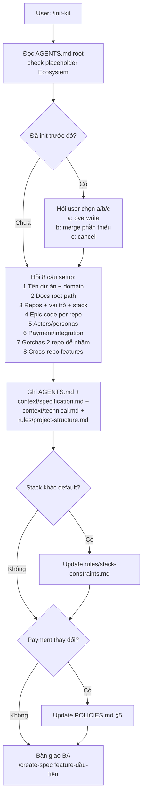

**❌ Không:** sửa source code · ghi đè khi đã init (phải hỏi user a/b/c).

---

### 3.1 `ba-agent` — Business Analyst

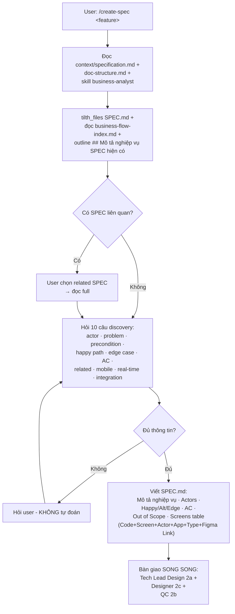

**❌ Không:** đưa giải pháp kỹ thuật · sửa source code · skip Bước 1.5 scan SPEC cũ.

---

### 3.2 `techlead-design-agent` — Tech Lead Design

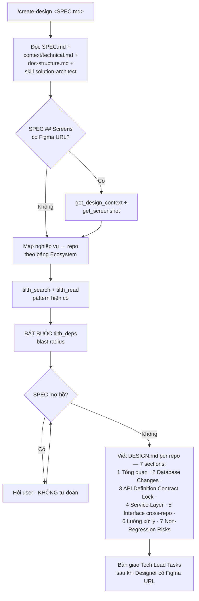

**❌ Không:** viết source code · tự đoán khi SPEC mơ hồ · bypass `tilth_deps`.

---

### 3.3 `qc-agent` — QC Manual Tester

> **Chạy 3 lần trong pipeline:** lần 1 = sinh TC sau SPEC (2b — pipeline 3 bước) · lần 2 = execution checklist trước release (7a) · lần 3 song song với 7c (QC Automation).

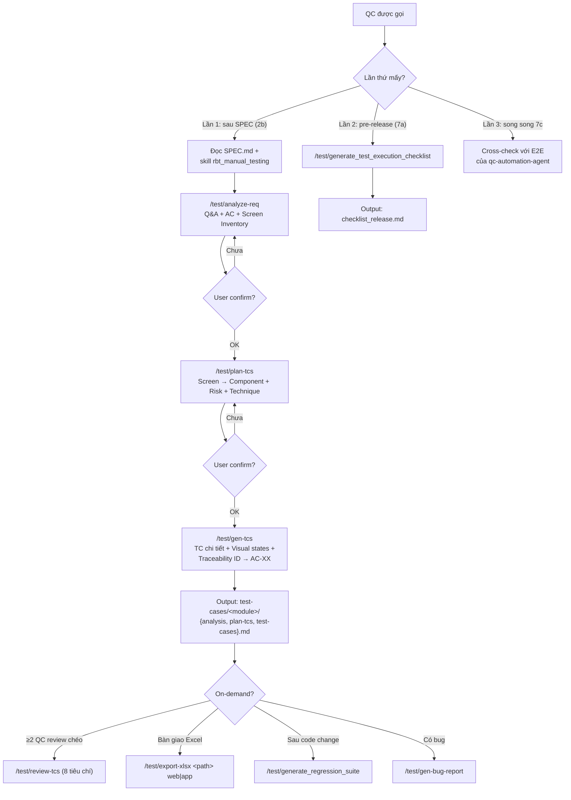

**❌ Không:** sinh TC khi chưa đọc SPEC · test data placeholder · gộp validation nhiều field · auto-submit bug lên Backlog · lẫn vai trò với `qa-agent` (không chạy test suite) · gọi thẳng `/gen-tcs` khi chưa có `plan-tcs.md` · skip user confirm giữa các bước pipeline.

---

### 3.4 `designer-agent` — UI/UX Designer

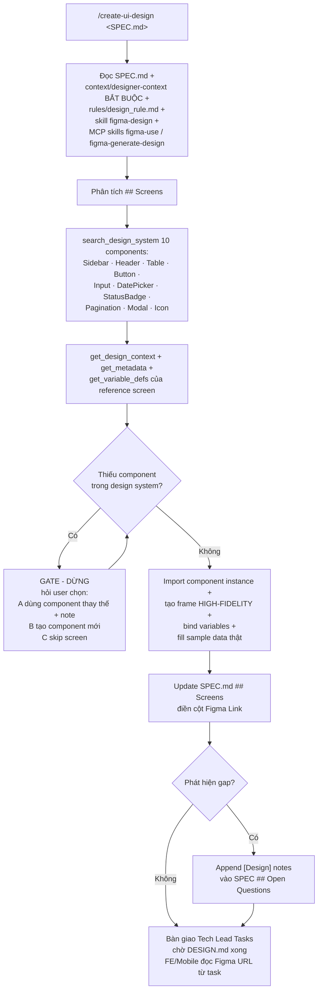

**❌ Không:** tạo file `.md` riêng (UI-SPEC.md / figma-context.md) · vẽ wireframe (rectangle + text) · tự generate component khi thiếu · commit / push code.

---

### 3.5 `techlead-tasks-agent` — Tech Lead Tasks

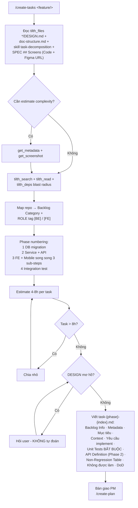

**❌ Không:** task > 8h · task thiếu Unit Test · tự đoán khi DESIGN mơ hồ · sửa source code.

---

### 3.6 `pm-agent` — Project Manager

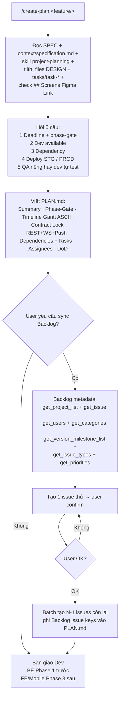

**❌ Không:** phân tích yêu cầu (BA việc) · design kỹ thuật (Tech Lead việc) · ghi số giả (dùng `TBD`) · sửa source code.

---

### 3.7 `backend-agent` — Backend Developer (NestJS)

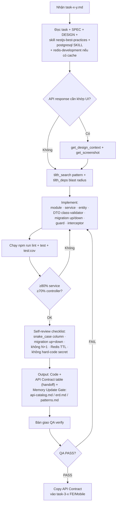

**❌ Không:** sửa migration / linter / test config không được yêu cầu · commit khi không được yêu cầu · hard-code secret · N+1 query.

---

### 3.8 `frontend-agent` — Frontend Developer (React)

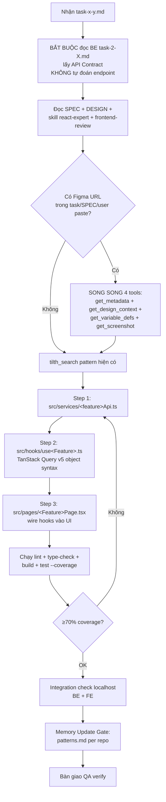

**❌ Không:** hard-code URL (dùng `import.meta.env.VITE_API_URL`) · tự đoán endpoint · mock data trong production code · lẫn domain giữa 2 repo frontend · `useHistory` (dùng `useNavigate`) · Redux cho server state.

---

### 3.9 `mobile-agent` — Mobile Developer (Flutter)

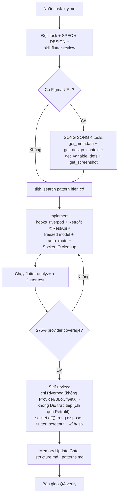

**❌ Không:** Provider/BLoC/GetX · hard-code pixel/hex · sửa `.g.dart`/`.freezed.dart` thủ công · đảo version convention (DEV `0.0.x` · STG `0.1.x` · PROD `1.0.x`) · `Navigator.push` trực tiếp.

---

### 3.10 `qa-agent` — QA Engineer

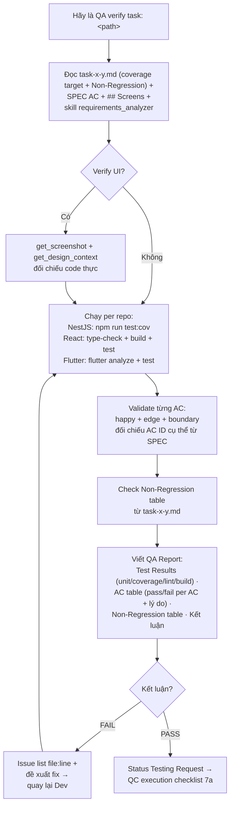

**❌ Không:** sửa source code · sinh manual TC (qc-agent việc) · so với assumption thay vì SPEC · thay đổi test cases đã approve.

---

### 3.11 `qc-automation-agent` — QC Automation Tester

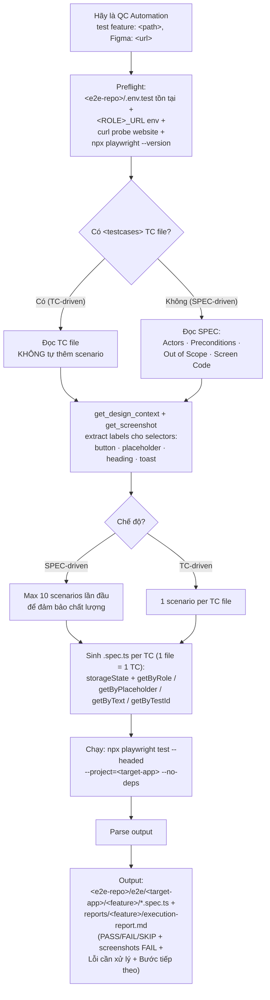

**❌ Không:** sửa source code app · CSS class selector (`.btn-primary`) · `waitForTimeout` cứng · hard-code credentials trong `.spec.ts` (dùng `process.env`) · > 20 TC lần đầu (SPEC-driven) · test phụ thuộc nhau · TC-driven mà tự thêm scenario.

---

## 4. Điểm audit thường gặp

| # | Điểm cần check | Cách verify |
|---|---|---|
| 1 | BA có scan SPEC cũ trước khi tạo mới không? | `ba-agent.md` Bước 1.5 phải có `business-flow-index.md` + outline SPEC + hỏi user related feature |
| 2 | Tech Lead có `tilth_deps` blast radius không? | DESIGN.md ## 7 Non-Regression Risks phải có nội dung thật, không placeholder |
| 3 | Task có Unit Test không? | Mỗi task-x-y.md phải có section "Unit Tests (BẮT BUỘC)" với coverage target |
| 4 | FE có tự đoán endpoint không? | task-3-x.md ## API Contract phải copy từ BE task-2-X, không tự viết |
| 5 | Designer có vẽ wireframe hay không? | Verify: mỗi frame Figma phải dùng component instance, không rectangle + text |
| 6 | QA có so với SPEC.md AC hay assumption? | QA Report phải trích AC ID cụ thể từ SPEC, không mô tả chung |
| 7 | QC Automation có headed mode không? | `execution-report.md` phải có screenshot; command có `--headed` |
| 8 | Memory Update Gate có bị skip không? | Sau mỗi dev task, output phải liệt kê `api-catalog.md` / `erd.md` / `patterns.md` — updated hay skipped |
| 9 | Handover message có natural language không? | Output cuối mỗi agent phải có `"Hãy là <role>, ..."` để user copy-paste |
| 10 | Agent có commit tự động không? | KHÔNG được — chỉ commit khi user yêu cầu rõ ràng |
| 11 | QC có chạy `/plan-tcs` trước `/gen-tcs` không? | `/gen-tcs` sẽ tự dừng nếu module chưa có `plan-tcs.md` — verify không skip bằng cách gọi thẳng `/gen-tcs` |
| 12 | QC có handle TBD ACs đúng không? | `/gen-tcs` phải hỏi user chọn A/B/C khi phát hiện TBD AC, không tự đoán |

---

## 5. Common failure modes

| Failure | Nguyên nhân | Cách phòng |
|---|---|---|
| BA sinh SPEC trùng lặp | Bỏ qua Bước 1.5 SPEC scan | Enforce trong `ba-agent.md` — không skip được |
| Tech Lead design conflict với code hiện có | Không chạy `tilth_deps` | Rule cứng trong POLICIES.md — vi phạm phải rollback |
| FE code với endpoint không tồn tại | Không đọc BE task-2-X ## API Contract | Frontend Agent Bước 2 BẮT BUỘC đọc BE task |
| QC Automation sinh selector CSS class | Không đọc Figma labels | qc-automation-agent Bước 3 đọc Figma trước khi viết spec |
| QA PASS nhưng vẫn miss AC | So với assumption thay vì SPEC | qa-agent Bước 3 đối chiếu AC ID từ SPEC.md |
| Task quá lớn, dev không xong trong session | techlead-tasks-agent ước lượng sai | Enforce 4-8h/task, chia nhỏ nếu > 8h |
| Backlog issues sync thiếu / sai | pm-agent Bước 4.2 verify metadata không kỹ | Tạo issue thử trước, user confirm mới batch |
| QC gọi thẳng `/gen-tcs` khi chưa có `plan-tcs.md` | Skip pipeline steps | Command tự dừng + hướng dẫn quay lại `/plan-tcs` |
| Test data placeholder ("email hợp lệ") lọt vào TC | `/gen-tcs` self-check yếu | Self-check tự grep placeholder, tự fix trước khi lưu |

---

## 6. Xem thêm

- **Canonical workflow từng agent:** `.claude/agents/<agent-name>.md`
- **BMAD pipeline chi tiết:** `.claude/workflows/new-feature.md`
- **Bug fix workflow:** `.claude/workflows/bug-fix.md`
- **AI behavior policy:** `POLICIES.md` (always-loaded qua `CLAUDE.md`)
- **Companion rules:** `.claude/rules/SECURITY.md` (restricted files) · `POLICY.md` (IP protection) · `RELIABILITY.md` (no hallucination)
- **Ecosystem (repos + actors + docs root):** `AGENTS.md` section `<ecosystem>`
- **Context files:** `.claude/context/` (đọc on-demand theo cột "Ai đọc" trong `AGENTS.md`)
- **Skills:** `.claude/skills/README.md`
- **Commands:** `.claude/commands/README.md`
- **QC pipeline 4 bước chi tiết:** `.claude/agents/qc-agent.md` — section "Quy trình chuẩn"
